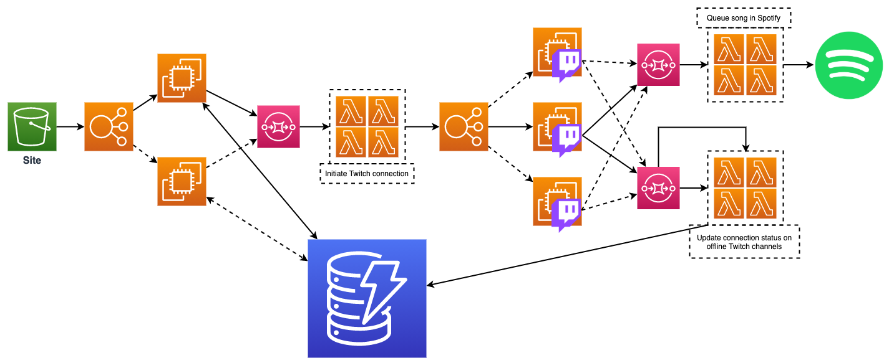

# TwitchSongRequests

This is yet another project that I will probably never finish. A Twitch
integration to enqueue song requests in Spotify. This project was inspired by
[Kaije](https://www.twitch.tv/kaije), because their Twitch channel has a channel
point reward for requesting a song on Spotify. On that fateful day, I requested
multiple songs in quick succession, and they told me to hold off on requesting
songs because they have to stop working on art in order to manually copy the
Spotify URIs I was sending, in order to queue the songs in their Spotify player.

## Table of Contents

1. [What does this project do?](#what-does-this-project-do)
    1. [How it works](#how-it-works)
    1. [Required Twitch accesses](#required-twitch-accesses)
    1. [Required Spotify accesses](#required-spotify-accesses)
1. [Running it locally](#running-it-locally)
1. [Testing](#testing)
1. [Secret management](#secret-management)
1. [Deployments](#deployments)
1. [Developing](#developing)

## What does this project do?

The purpose of this project is to allow Twitch streamers to integrate their
channel point redemptions with Spotify song requests.

#### How it works

By reading the specific channel topic for when channel points are redeemed, this
app can intercept those events, and given a specific type of request, we can
act on a specific channel point redemption to invoke queueing up a song in Spotify.
We can make individual asynchronous API calls to the Spotify API in order to queue
songs to an active player.

The overall proposed archicture is shown below, and explained in greater detail:



How it will work is that there will be a website that people interact with. On this
site, they will walk through authorizing the app to read/modify data in Twitch and
Spotify on the user's behalf. After authorizing, this will send an API request to a
server. The server handles the request, which includes the authorization codes from
both of the authorization requests in the UI, and uses them to fetch OAuth 2.0 tokens
from both the Twitch and Spotify APIs. These will be the main authentication model
for interacting with all of the integrations.

The main app will start up a WebSocket connection to the Twitch API in order to receive
events from a channel, which includes channel point redemption events. Upon receiving
a channel redemption event, we parse the event and queue up the data by throwing it
into SQS. The SQS is used as an event source for a Lambda function which handles
processing the inputs to queue up a song in Spotify. The lambda will need to read data
from DynamoDB in order to fetch the authentication information needed for the Spotify
calls.

A DynamoDB table is used to store state. The diagram shows two tables, but it could
also be done in a single table that has a superset of the data in both tables. The API
will expose an endpoint which is just a direct read from the table that the UI can use
to poll for the active connection status. Another proposed functionality is to allow
the user to explicitly cancel/close their "connection", to stop the app from consuming
events and queueing song requests.

### Required Twitch accesses

For the Twitch integration, this project requires privileged access to the
`channel_read` and `channel:read:redemptions` scopes. The first one is so that
the app can fetch the channel ID, which is a required step in identifying which
individual channel topic to listen to. The second one is to grant the app access
to read channel point redemption events from their stream.

### Required Spotify accesses

For the Spotify integration, this project requires privileged access to the
`user-modify-playback-state` scope in order to enqueue songs to a user's player, and
access to the `user-read-playback-state` scope in order to read what available
players there are, and what song is currently playing.

## Running the server code locally

Here's a quick way to get the server up and running, with the steps explained
in greater detail below:

```bash
git clone https://github.com/SaxyPandaBear/TwitchSongRequests.git
cd TwitchSongRequests
# put credentials in ./server/config/credentials.json

```

The main server code in the `server` directory (maybe a little too on-the-nose).
This requires a `./server/config/credentials.json` file to run. That file is gitignored, so
it's safe to create it and drop it next to the main app code.

Create a `credentials.json` file and place it in the config directory, `./server/config/credentials.json`.
The `./server/app.js` file uses the credentials file template as a guideline.

Place all of the required sensitive data in that file so that the app can read
from it and reference that data.

TODO: Define a process for injecting a properties file

### Running the app

TBD

### Demo applications to proof-of-concept the tech

```bash
cd demo
# populate the authorization codes in your local credentials.json file
node twitch.js
node spotify.js
```

An example of what log output for the Twitch demo looks like:

```
INFO: Socket Opened
SENT: {"type":"PING"}
{ message: { type: 'PONG' } }
{ message: { type: 'RESPONSE', error: '', nonce: 'abc123' } }
{ message:
   { type: 'MESSAGE',
     data:
      { topic: 'channel-points-channel-v1.106060203',
        message: '{"type":"reward-redeemed","data":{"timestamp":"2020-08-23T20:21:56.588735036Z","redemption":{"id":"897dd20c-ec7f-42da-9e0a-610091785a4d","user":{"id":"106060203","login":"saxypandabear","display_name":"SaxyPandaBear"},"channel_id":"106060203","redeemed_at":"2020-08-23T20:21:56.588735036Z","reward":{"id":"ca20aaa2-5fa8-4b29-a9a6-34275ee911f4","channel_id":"106060203","title":"Song Request","prompt":"Only applies for music streams. Request a song you want
me to attempt to learn by ear.","cost":10000,"is_user_input_required":true,"is_sub_only":false,"image":null,"default_image":{"url_1x":"https://static-cdn.jtvnw.net/custom-reward-images/default-1.png","url_2x":"https://static-cdn.jtvnw.net/custom-reward-images/default-2.png","url_4x":"https://static-cdn.jtvnw.net/custom-reward-images/default-4.png"},"background_color":"#FA2929","is_enabled":true,"is_paused":false,"is_in_stock":true,"max_per_stream":{"is_enabled":false,"max_per_stream":0},"should_redemptions_skip_request_queue":false,"template_id":null,"updated_for_indicator_at":"2020-01-01T15:11:26.647212555Z","max_per_user_per_stream":{"is_enabled":false,"max_per_user_per_stream":0},"global_cooldown":{"is_enabled":false,"global_cooldown_seconds":0},"redemptions_redeemed_current_stream":0,"cooldown_expires_at":null},"user_input":"hello","status":"UNFULFILLED"}}}' } } }
```

Note that subsequent runs of the application(s) require a new authorization code
for each run.

### OAuth authentication flow

There is a [v2.1 Postman collection](./TwitchSongRequestsReference.postman_collection.json) exported to the root of the project directory
that documents the required authorization calls.

## Testing

TBD

## Secret management

For now, secret management is done simply in the `server/config/credentials.json` file.
The template file helps to show what to expect in the credentials file:

```javascript
{
    "twitch_client_id": "TWITCH_ID",
    "twitch_client_secret": "TWITCH_SECRET",
    "spotify_client_id": "SPOTIFY_ID",
    "spotify_client_secret": "SPOTIFY_SECRET"
}
```

Replacing the values to the existing keys should suffice, since the main app is
reading in the raw JSON file, and referencing keys in the JSON object directly.

## Deployments

TBD

## Developing
What are the tools you need in order to start contributing on the project? 

1. NodeJS
1. Docker
1. Python3
1. [Pipenv](https://github.com/pypa/pipenv)

The code for this is all written in Javascript with Node. We're using 
[node-fetch](https://github.com/node-fetch/node-fetch) for handling HTTP request stuff.

> all written in Javscript with Node

If all of the code is written in JS, why is Python a requirement? We use Python mostly 
for [localstack](https://github.com/localstack/localstack), which is a nifty tool that
helps with local development in a simulated AWS environment (this is why we need 
docker, too).

To get started, just clone/fork the repo, and from the root, you will want to first 
install the dependencies.

```bash
# 1. Install localstack and aws cli in the virtual env (provided in pipfile)
pipenv install
# 2. For UI developlment, move to the ui directory and install dependencies
cd ./ui
npm install
cd ..
# 3. For server-side code development, move to the server directory and install depdencies
cd ./server
npm install
cd ..
# 4. Start up localstack (in another shell)
# START COMMANDS ON DIFFERENT SHELL TERMINAL
pipenv shell
localstack start # Make sure you have Docker running on your machine before this step
# END COMMANDS ON DIFFERENT SHELL TERMINAL
# 5. while localstack starts up, we can run the orchestration script, since it waits
#    for localstack to be healthy before continuing. Before we can run the script, we
#    have to inject credentials to our environment variables. The orchestration script
#    uses them to inject credentials into the local AWS services (like lambda)
export TWITCH_CLIENT_ID=abc123
export TWITCH_CLIENT_SECRET=abc234
export SPOTIFY_CLIENT_ID=abc345
export SPOTIFY_CLIENT_SECRET=abc456
./start-cloud.sh

#[DONE] Now that the infrastructure is all built, we can work with all of our services!
```
