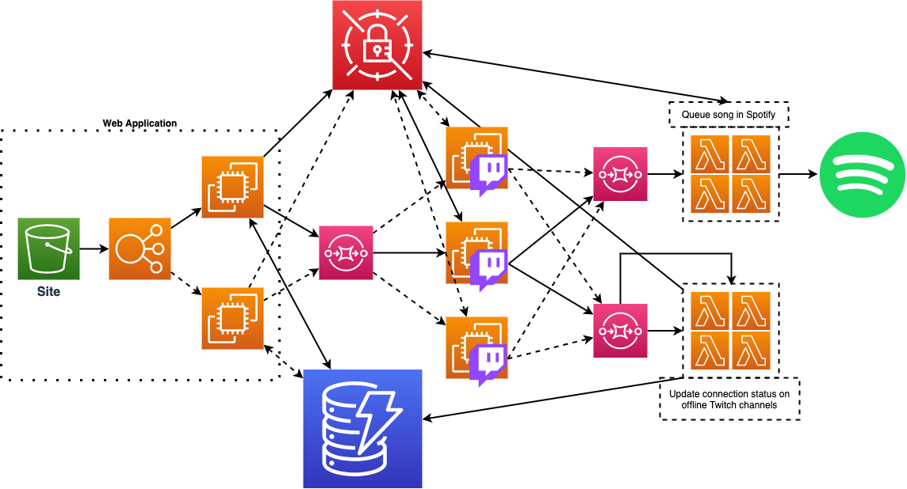

# TwitchSongRequests

This is yet another project that I will probably never finish. A Twitch
integration to enqueue song requests in Spotify. This project was inspired by
[Kaije](https://www.twitch.tv/kaije), because their Twitch channel has a channel
point reward for requesting a song on Spotify. On that fateful day, I requested
multiple songs in quick succession, and they told me to hold off on requesting
songs because they have to stop working on art in order to manually copy the
Spotify URIs I was sending, in order to queue the songs in their Spotify player.

## Table of Contents

1. [What does this project do?](#what-does-this-project-do)
    1. [How it works](#how-it-works)
    1. [Required Twitch accesses](#required-twitch-accesses)
    1. [Required Spotify accesses](#required-spotify-accesses)
1. [Running it locally](#running-it-locally)
1. [Testing](#testing)
1. [Secret management](#secret-management)
1. [Deployments](#deployments)
1. [Developing](#developing)

## What does this project do?

The purpose of this project is to allow Twitch streamers to integrate their
channel point redemptions with Spotify song requests.

#### How it works

By reading the specific channel topic for when channel points are redeemed, this
app can intercept those events, and given a specific type of request, we can
act on a specific channel point redemption to invoke queueing up a song in Spotify.
We can make individual asynchronous API calls to the Spotify API in order to queue
songs to an active player.

The overall proposed archicture is shown below, and explained in greater detail:



How it will work is that there will be a website that people interact with. On this
site, they will walk through authorizing the app to read/modify data in Twitch and
Spotify on the user's behalf. After authorizing, this will send an API request to a
server. The server handles the request, which includes the authorization codes from
both of the authorization requests in the UI, and uses them to fetch OAuth 2.0 
tokens from both the Twitch and Spotify APIs. These will be the main 
authentication model for interacting with all of the integrations.

The main app will start up a WebSocket connection to the Twitch API in order to 
receive events from a channel, which includes channel point redemption events. 
Upon receiving a channel redemption event, we parse the event and queue up 
the data by throwing it into SQS. The SQS is used as an event source for a 
Lambda function which handles processing the inputs to queue up a song in Spotify. 
The lambda will need to read data from DynamoDB in order to fetch the 
authentication information needed for the Spotify calls.

A DynamoDB table is used to store state. The diagram shows two tables, but it could
also be done in a single table that has a superset of the data in both tables. 
The API will expose an endpoint which is just a direct read from the table that 
the UI can use to poll for the active connection status. Another proposed 
functionality is to allow the user to explicitly cancel/close their "connection", 
to stop the app from consuming events and queueing song requests.

### Required Twitch accesses

For the Twitch integration, this project requires privileged access to the
`channel_read` and `channel:read:redemptions` scopes. The first one is so that
the app can fetch the channel ID, which is a required step in identifying which
individual channel topic to listen to. The second one is to grant the app access
to read channel point redemption events from their stream.

### Required Spotify accesses

For the Spotify integration, this project requires privileged access to the
`user-modify-playback-state` scope in order to enqueue songs to a user's player,
and access to the `user-read-playback-state` scope in order to read what 
available players there are, and what song is currently playing.

## Running the server code locally

Here's a quick way to get the server up and running, with the steps explained
in greater detail below:

```bash
git clone https://github.com/SaxyPandaBear/TwitchSongRequests.git
cd TwitchSongRequests
# put credentials in ./bff/config/credentials.json

```

The main backend-for-frontend code is in the `bff` directory 
(maybe a little too on-the-nose).
This requires a `./bff/config/credentials.json` file to run. 
That file is gitignored, so it's safe to create it and drop it 
next to the main app code.

Create a `credentials.json` file and place it in the config directory, 
`./bff/config/credentials.json`. Use the credentials file template as a guideline.

Place all of the required sensitive data in that file so that the app can read
from it and reference that data.

### Running the app

TBD

### Demo applications to proof-of-concept the tech

```bash
cd demo
# populate the authorization codes in your local credentials.json file
node twitch.js
node spotify.js
```

An example of what log output for the Twitch demo looks like:

```
INFO: Socket Opened
SENT: {"type":"PING"}
{ message: { type: 'PONG' } }
{ message: { type: 'RESPONSE', error: '', nonce: 'abc123' } }
{ message:
   { type: 'MESSAGE',
     data:
      { topic: 'channel-points-channel-v1.106060203',
        message: '{
            "type":"reward-redeemed",
            "data":{
                "timestamp":"2020-08-23T20:21:56.588735036Z",
                "redemption":{
                    "id":"897dd20c-ec7f-42da-9e0a-610091785a4d",
                    "user":{
                        "id":"106060203","login":"saxypandabear","display_name":"SaxyPandaBear"
                    },
                    "channel_id":"106060203",
                    "redeemed_at":"2020-08-23T20:21:56.588735036Z",
                    "reward":{
                        "id":"ca20aaa2-5fa8-4b29-a9a6-34275ee911f4","channel_id":"106060203","title":"Song Request","prompt":"Only applies for music streams. Request a song you want me to attempt to learn by ear.","cost":10000,"is_user_input_required":true,"is_sub_only":false,"image":null,"default_image":{"url_1x":"https://static-cdn.jtvnw.net/custom-reward-images/default-1.png","url_2x":"https://static-cdn.jtvnw.net/custom-reward-images/default-2.png","url_4x":"https://static-cdn.jtvnw.net/custom-reward-images/default-4.png"},"background_color":"#FA2929","is_enabled":true,"is_paused":false,"is_in_stock":true,"max_per_stream":{"is_enabled":false,"max_per_stream":0},"should_redemptions_skip_request_queue":false,"template_id":null,"updated_for_indicator_at":"2020-01-01T15:11:26.647212555Z","max_per_user_per_stream":{"is_enabled":false,"max_per_user_per_stream":0},"global_cooldown":{"is_enabled":false,"global_cooldown_seconds":0},"redemptions_redeemed_current_stream":0,"cooldown_expires_at":null
                    },
                    "user_input":"hello",
                    "status":"UNFULFILLED"
                    }
                }
            }' 
        } 
    } 
}
```

Note that subsequent runs of the application(s) require a new authorization code
for each run.

### OAuth authentication flow

There is a [v2.1 Postman collection](./TwitchSongRequestsReference.postman_collection.json) 
exported to the root of the project directory that documents the required 
authorization calls.

## Testing

TBD

## Secret and Configuration management

Config management is done differently for the different components (unfortunately).

#### Local development infrastructure
Local development requires the Twitch and Spotify client credentials to be injected
into environment variables. The `./start-cloud.sh` script will use these 
environment variables to inject them into the necessary services that get built in
the CloudFormation stack. 

#### UI
The UI doesn't store any sensitive information, but it does store our public 
client IDs for Twitch and Spotify. We leverage `environment.ts` configurations in 
Angular to handle this. 

#### BFF

Property management is done simply in the `credentials.json` file, although this
is expected to change soon. The template file helps to show what to expect in the 
credentials file:

```javascript
{
    "twitch_client_id": "TWITCH_ID",
    "twitch_client_secret": "TWITCH_SECRET",
    "spotify_client_id": "SPOTIFY_ID",
    "spotify_client_secret": "SPOTIFY_SECRET"
}
```

Replacing the values to the existing keys should suffice, since the main app is
reading in the raw JSON file, and referencing keys in the JSON object directly.

#### Main Server
The main workhorse application is a Scala app that smells like a Java app. 
Properties are read in via typical Java techniques. The properties file(s) live in
the `./server/src/main/resources` folder, and can use an argument passed in as an 
extra parameter to starting up the main built jar in order to point to a specific
configuration (i.e.: local vs deployed).

## Deployments

TBD

## Developing

What are the tools you need in order to start contributing on the project?

1. NodeJS (this comes with NPM)
1. Docker
1. Python3
1. [Pipenv](https://github.com/pypa/pipenv)
1. Scala 2.12+
1. Gradle

The project is split up into several components that live in the same mono repo.

Proof-of-concept scripts live in `demo`, which are left there to show our humble
beginnings.

The infrastructure is defined in a CloudFormation Template, in `services.json`,
and can be stood up in local development with the use of 
[localstack](https://github.com/localstack/localstack), which is a nifty tool that
helps with local development in a simulated AWS environment.

The lambda code that performs the duty of queueing songs into Spotify based on SQS
messages is in the folder that is aptly named `queue-song-lambda`. It's written in
NodeJS.

The UI code, funnily enough, is in the `ui` folder.

The "server" code, which is mostly for handling the WebSocket connections to 
Twitch is written in Scala, with a REST API in front of it to handle requests
to start listening to a connection, or to stop listening to a specific topic.

### Running the components

To get started, just clone/fork the repo, and from the root, you will want to first
install the dependencies.

```bash
# 1. Install localstack and aws cli in the virtual env (provided in pipfile)
pipenv install
# 2. For UI developlment, move to the ui directory and install dependencies
cd ./ui
npm install
cd ..
# 3. For server-side code development, there are two directories, but let's focus
#    on the bff directory, which servers API requests from the frontend.
#    Change to the ./bff directory and install dependencies
cd ./bff
npm install
cd ..
# 4. Start up localstack (in another shell)
# START COMMANDS ON DIFFERENT SHELL TERMINAL
pipenv shell
localstack start # Make sure you have Docker running on your machine before this step
# END COMMANDS ON DIFFERENT SHELL TERMINAL
# 5. while localstack starts up, we can run the orchestration script, since it waits
#    for localstack to be healthy before continuing. Before we can run the script, we
#    have to inject credentials to our environment variables. The orchestration script
#    uses them to inject credentials into the local AWS services (like lambda)
export TWITCH_CLIENT_ID=abc123
export TWITCH_CLIENT_SECRET=abc234
export SPOTIFY_CLIENT_ID=abc345
export SPOTIFY_CLIENT_SECRET=abc456
./start-cloud.sh

#[DONE] Now that the infrastructure is all built, we can work with all of our services!
```

TODO: add how to run the main server code.
